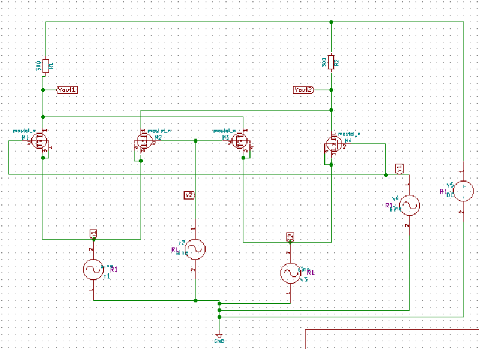
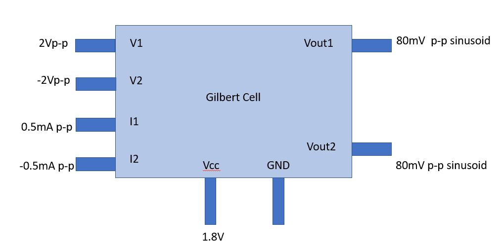
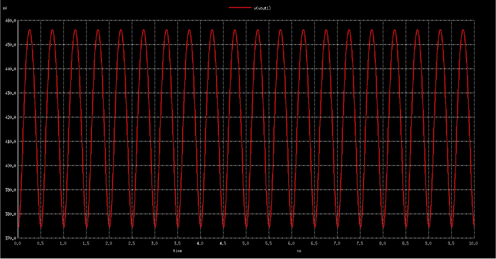
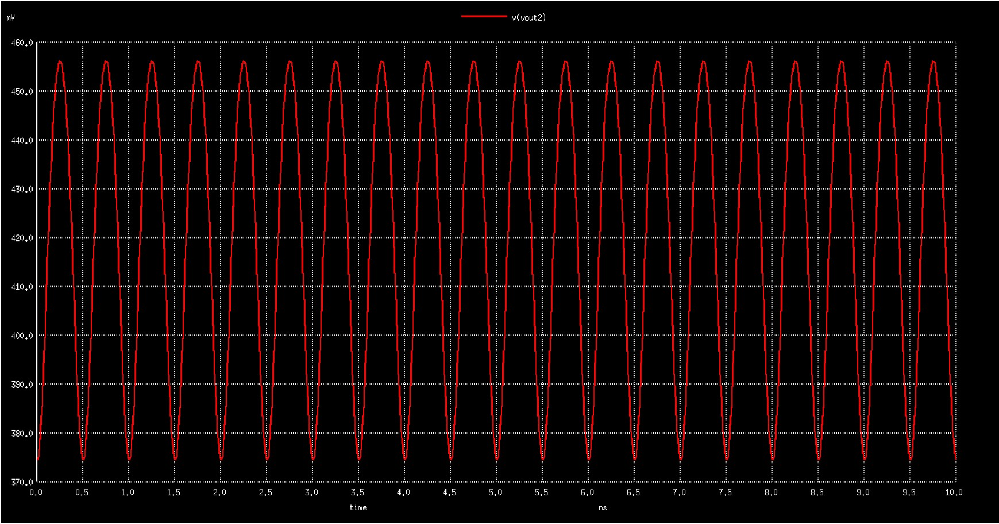
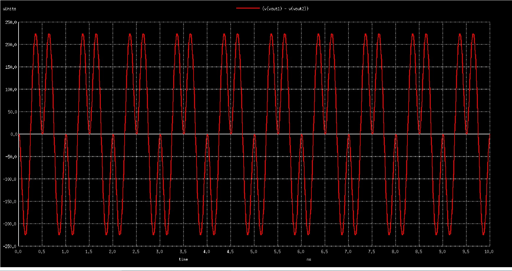
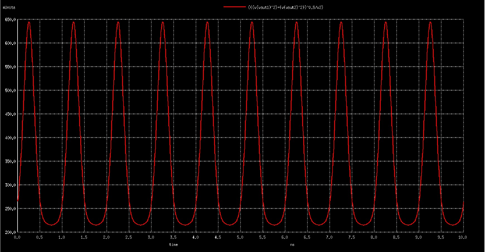
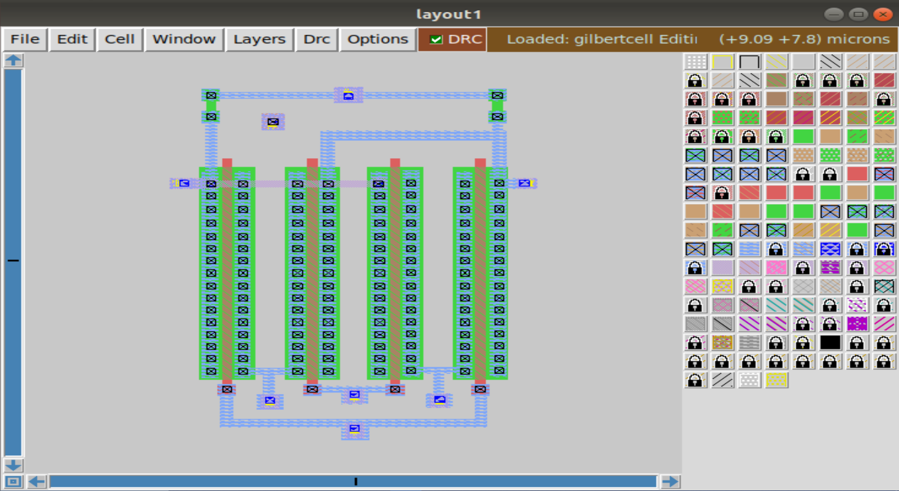
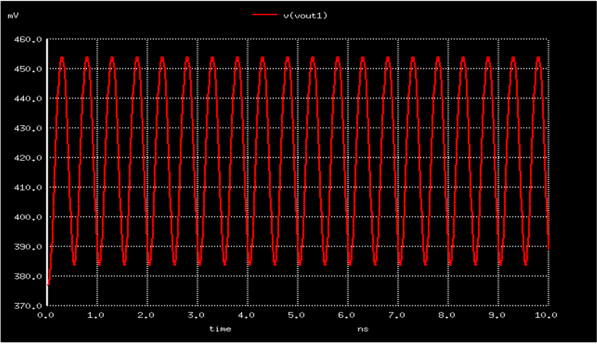
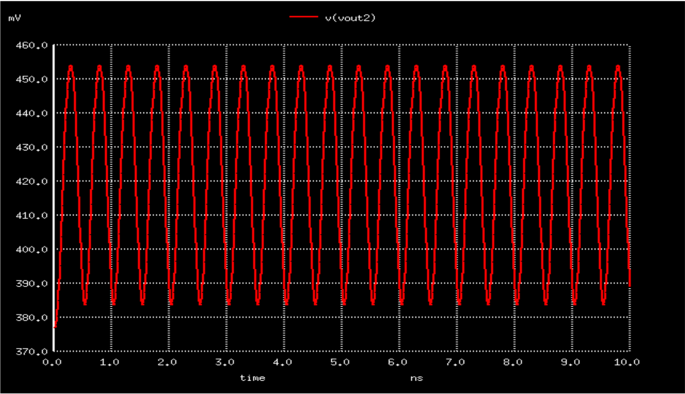
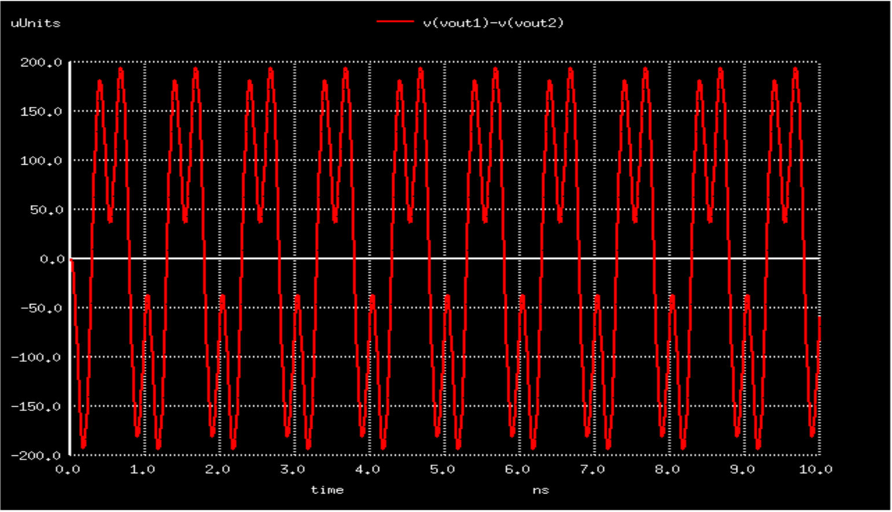

# avsd_gilbert_cell
  
  
  - The aim of the project is to simulated **Gilbert Multiplier Cell** using Skywater 130 nm PDK and other open source softwares
  
    


# Content
  - [Open Source Tools Required](#O)
  - [Block Diagram](#B)
  - [Installation](#I)
  - [Clone this repository](#C)
  - [Pre layout simulation](#Pr)
  - [Layout design using magic](#L)
  - [Post layout simulation](#Po)

<h3 id="O">Open Source Tools Required </h3>

- [x] **eSim**
- [x] **Skywater 130nm**
- [x] **ngspice**
- [x] **magic**

- <a href='https://esim.fossee.in/home' target="_blank"> **eSim** </a>

    - **eSim** (previously known as Oscad / FreeEDA) is a free/libre and open source EDA tool for circuit design, simulation, analysis and PCB design. It is an integrated tool built using free/libre and open source software such as **KiCad, Ngspice and GHDL**. eSim is released under GPL.

    - **eSim** offers similar capabilities and ease of use as any equivalent proprietary software for schematic creation, simulation and PCB design, without having to pay a huge amount of money to procure licenses. Hence it can be an affordable alternative to educational institutions and SMEs. It can serve as an alternative to commercially available/licensed software tools like OrCAD, Xpedition and HSPICE.


- <a href='https://github.com/google/skywater-pdk' target="_blank"> **Skywater 130nm** </a>

    - The SkyWater Open Source PDK is a collaboration between Google and SkyWater Technology Foundry to provide a fully open source Process Design Kit and related resources, which can be used to create manufacturable designs at SkyWater’s facility. 
 
 
- <a href='http://ngspice.sourceforge.net/' target="_blank"> **ngspice** </a>

  - Ngspice is a mixed-level/mixed-signal electronic circuit simulator. 


- <a href='http://opencircuitdesign.com/magic/' target="_blank"> **magic** </a>

  - Magic is a venerable VLSI layout tool, written in the 1980's at Berkeley by John Ousterhout, now famous primarily for writing the scripting interpreter language Tcl. Due largely in part to its liberal Berkeley open-source license, magic has remained popular with universities and small companies. The open-source license has allowed VLSI engineers with a bent toward programming to implement clever ideas and help magic stay abreast of fabrication technology.


<h3 id="B">Block Diagram</h3>
 
 
 

<h3 id="I">Installation</h3>
 
- The eSim Software is available for Windows 7, 8 and 10 and Ubuntu 16.04 LTS and above

- The Magic Design Tool is available for Ubuntu
- Ngspice is auto-installed when eSim is installed,for higher version do refer [Ngspice installation](#ng) section

- The Pre-requisites for installing the following in Ubuntu are 
    ```
    $ sudo apt-get update
    ```
    - git installation
 
 
    ```
    $ sudo apt install git
    ```
    - make installation
    
    
    ```
    $ sudo apt install make
    ```

# eSim Installation

- https://static.fossee.in/esim/installation-files/Install_eSim_on_Windows.pdf

- https://github.com/FOSSEE/eSim/blob/master/INSTALL

<h3 id="ng">Ngspice Installation</h3>

- http://ngspice.sourceforge.net/download.html

# SkyWater PDK Installation

- For Windows
    - Download the GitHub Repository : https://github.com/google/skywater-pdk

- For Ubuntu
    In terminal, execute the following commands

    - Download the repository into the current working directory
        ```
        $ git clone git://opencircuitdesign.com/open_pdks
        ```

    - Go to `open_pks` directory
        ```
        $ cd open_pdks
        ```

    - Configure and install
        ```
        $ ./configure --enable-sky130-pdk

        $ make

        $ sudo make install
        ```

# Magic Installation

- To download the repository into the current working directory
    ```
    $ git clone git://opencircuitdesign.com/magic
    ```

- Navigate to `magic` directory

    ```
    $ cd magic
    ```

- Configure and install
    ```
    $ sudo ./configure

    $ sudo make

    $ sudo make install
    ```
    

<h3 id="C">Clone this repository</h3>

  ```
  $ git clone https://github.com/vaikunth-coder27/avsd_gilbert_cell.git
  ```
  

<h3 id="Pr">Pre Layout Simulation</h3>

  - Navigate to **pre_layout_simulation** folder
  ```
  $ cd Pre_layout_simulation
  ```
  
  - Execute the gilbertmultiplier.cir.out file
  ```
  $ ngspice gilbertmultiplier.cir.out
  ```
  
  - On simulation the following output graphs are obtained
  
  # Output Graphs
  
   - output Graph - 1
   
   
   
   
   - output Graph - 2
   
   
   
   
   - output Graph - 3
   
   
   
   
   - Total Harmonic Distortion(THD)
   
   
   

<h3 id="L">Layout Design Using Magic</h3>

  - Now navigate to sky130_nm_PDK from base working directory
  ```
  $ cd sky130_nm_PDK
  $ cp sky130A.tech <target-destination>
  ```
  
   
   
   - Save the changes made by executing
   ```
   % save <file_name>
   ```
   - Conversion of **.mag** file into ngspice executable
    - Extract the **.mag** file using (from tkcon terminal)(magic terminal)
        ```
        % extract all
        ```
   - Convert **.ext** to **.spice** using
        ```
        % ext2spice
        ```
   

<h3 id="Po">Post Layout Simulation</h3>

  - Navigate to **post_layout_simulation** folder
  ```
  $ cd Post_layout_simulation
  ```
  
  - Execute the gilbertmultiplier.cir.out file
  ```
  $ ngspice gilbertmultiplier.cir.out
  ```
  
  - On simulation the following output graphs are obtained
  
  # Output Graphs
  
   - output Graph - 1
   
   
   
   
   - output Graph - 2
   
   
   
   
   - output Graph - 3
   
   
   
   
   - Total Harmonic Distortion(THD)
   
   
   
# Author 
  - Vaikunth Guruswamy

# Acknowledgements
  
  - Kunal Ghosh, Co-founder, VLSI System Design (VSD) Corp. Pvt. Ltd. - kunalghosh@gmail.com
  
  
   
   
